# Automated SOC Incident Response Pipeline with Wazuh, TheHive & Shuffle

## Architecture Overview

## Overview

In this project, I simulated a credential dumping attack using Mimikatz on a Windows client. The purpose was to understand how a SOC Level 1 analyst detects, investigates, and responds to high-risk attacks using SIEM and SOAR tools.

## What Problem It Solves

This project demonstrates how SOC analysts can detect, investigate, and respond to credential dumping attacks using an integrated SIEM and SOAR platform. It shows the complete incident response lifecycle from detection to automated response actions.

## Pipeline Overview

- Wazuh SIEM detects Mimikatz execution
- Alerts automatically sent to Shuffle SOAR
- IOC extraction and VirusTotal enrichment
- Case creation in TheHive for tracking
- Analyst notification and response options

## Key Outcomes

- Automated detection of credential dumping
- Streamlined alert handling workflow
- Automated incident case creation
- Analyst-driven response actions

## Technologies Used

- **Wazuh SIEM** - Security Information and Event Management
- **TheHive** - Case Management Platform
- **Shuffle** - Security Orchestration, Automation, and Response (SOAR)
- **Windows Client** - Target endpoint for attack simulation
- **Mimikatz** - Credential dumping tool (used for simulation)
- **VirusTotal API** - IOC enrichment and threat intelligence
- **Webhooks** - Integration between tools
- **Email** - Analyst notifications

## Step-by-Step Implementation

### Step 1: Lab Setup

I set up a SOC home lab with a Windows client, Wazuh SIEM, TheHive for case management, and Shuffle for automation. The Windows client was configured with the Wazuh agent to collect logs and security events.

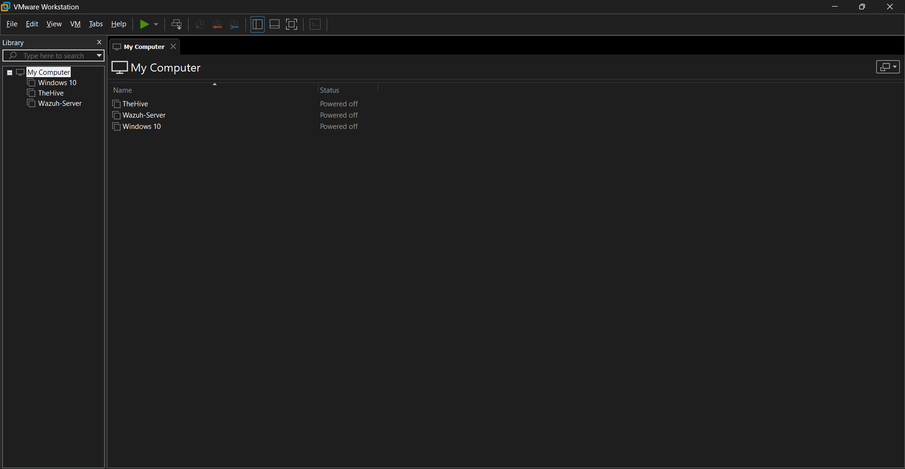

### Step 2: Installing and Configuring Wazuh

I installed Wazuh and verified that logs from the Windows client were successfully being ingested. This allowed me to monitor system activity in real time.

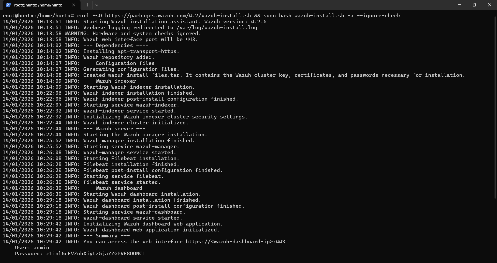
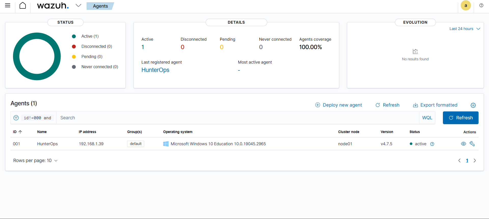

### Step 3: Simulating the Attack (Mimikatz Execution)

To simulate a real attack, I executed Mimikatz on the Windows client to perform credential dumping. This action generated suspicious behavior such as memory access and abnormal process execution.

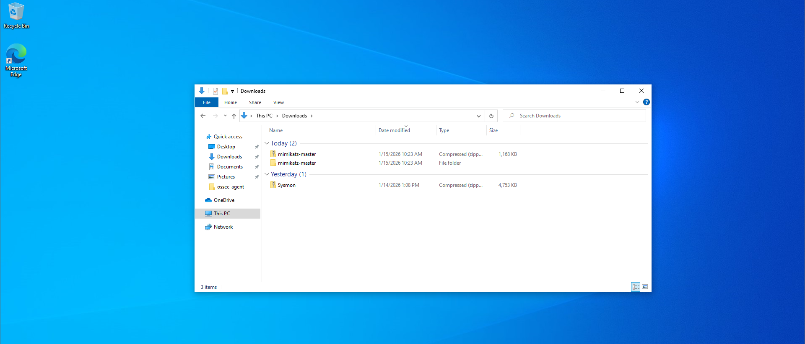

### Step 4: Detecting Mimikatz Using Custom Wazuh Rules

I created custom Wazuh detection rules to identify Mimikatz usage based on suspicious process names, command-line execution patterns, and known Mimikatz indicators. Once Mimikatz was executed, Wazuh successfully generated a high-severity alert.

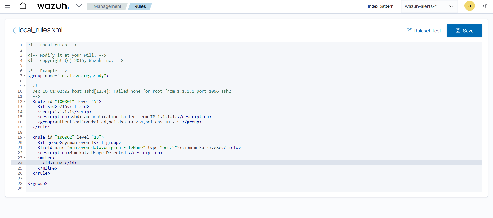
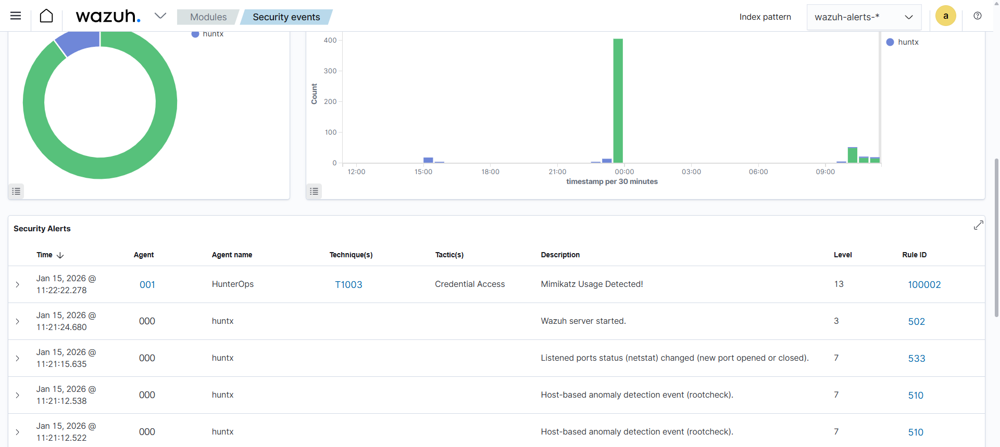

### Step 5: Sending Alerts to Shuffle via Webhook

I configured Wazuh to send Mimikatz alerts to Shuffle using a webhook. This allowed the alert to automatically enter the SOAR workflow without manual intervention.

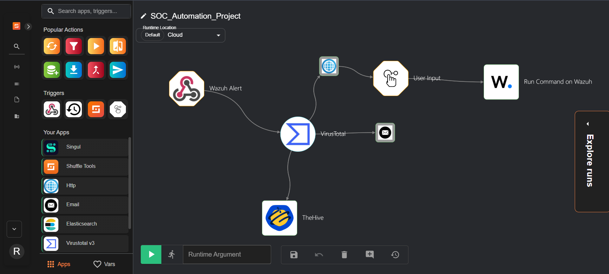

### Step 6: IOC Extraction & VirusTotal Enrichment

In Shuffle, I extracted IOCs such as process name, hash, and associated IP or domain (if present). These IOCs were checked against VirusTotal to confirm malicious behavior.

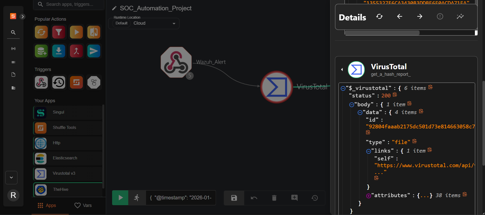

### Step 7: Case Creation in TheHive

After enrichment, I automatically created a case in TheHive with alert details, severity level, and IOC analysis results. This helped document the incident for investigation and tracking.

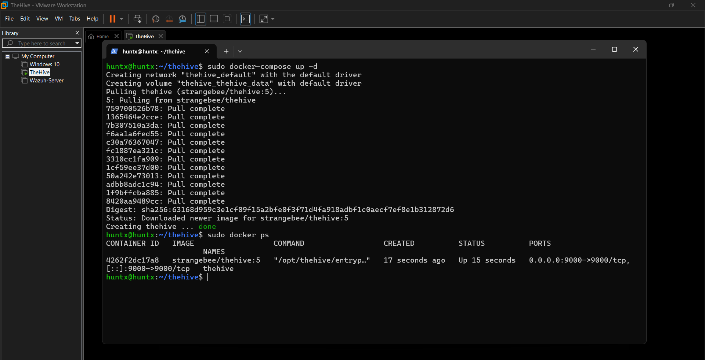
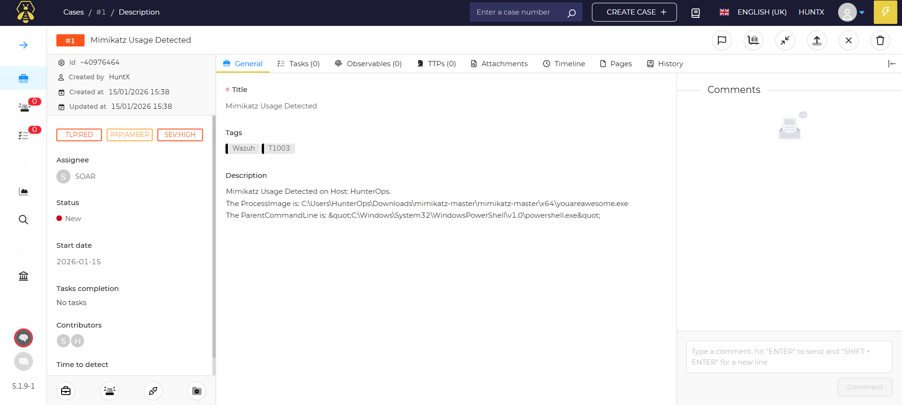

### Step 8: SOC Analyst Notification

I configured Shuffle to send an email notification to the SOC analyst when a Mimikatz alert was detected. This ensured immediate awareness of a credential dumping attack.

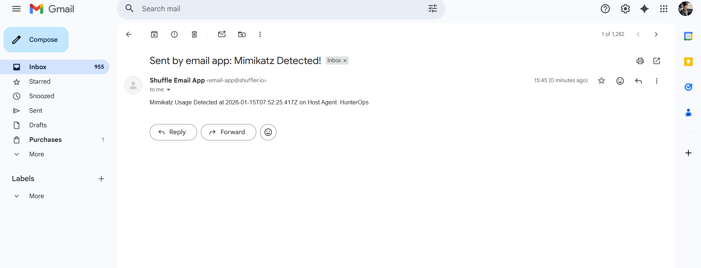

### Step 9: Analyst Decision & Automated Response

The SOC analyst was given multiple response options: isolate the endpoint, block the malicious process, or disable the compromised user. Based on the analyst's selection, Shuffle sent commands back to Wazuh, which executed the response on the Windows agent.

## Final Result

This pipeline successfully demonstrated:

- ✅ Detection of credential dumping
- ✅ Automated alert handling
- ✅ Incident creation
- ✅ Analyst-driven response actions

## Key Features

- Wazuh SIEM for real-time security monitoring and detection
- Custom Wazuh rules for Mimikatz credential dumping detection
- Shuffle SOAR platform for automated incident response workflows
- TheHive case management for incident tracking and documentation
- VirusTotal integration for IOC enrichment
- Automated email notifications to SOC analysts
- Analyst-driven response actions with multiple options

## Key Skills Demonstrated

- SIEM configuration and custom rule creation
- SOAR workflow automation
- IOC extraction and enrichment
- Case management integration
- Incident response automation
- Security tool integration

## Project Links

- **GitHub Repository**: [Automated-SOC-Incident-Response-Pipeline](https://github.com/rehmanwaraich07/Automated-SOC-Incident-Response-Pipeline)

## Important Note: Lab Environment

I built and tested this in a controlled home lab environment, not in a live production SOC. The goal here is to demonstrate my understanding of SIEM + SOAR integration, automated incident response workflows, and real-world SOC incident handling processes for credential dumping attacks.

In production, I would implement additional security controls, error handling, audit logging, role-based access controls, and comprehensive testing before deploying such automation workflows to protect real systems and respond to actual security incidents.

